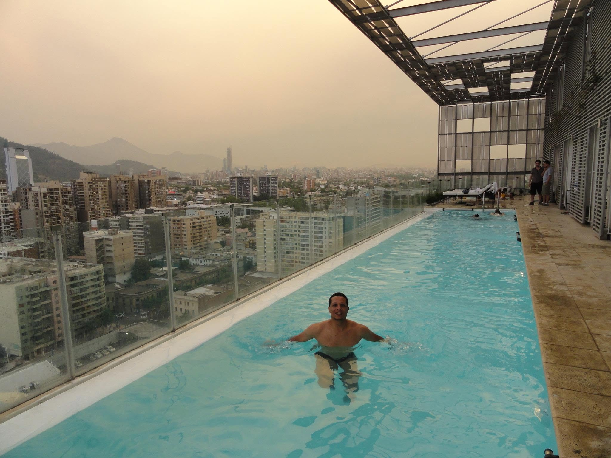

Santiago é uma cidade numa planicie. Tem muitas arvores, pessoas a pé e de bicicleta pelas ruas. Há carabineros (policiais) em quase todas as esquinas do centrão. O metrô tem 4 linhas principais e uma complementar. Os trens sao muito velhos e rápidos. em cada vagão há apenas 16 cadeiras e cabem umas 120 pessoas em pé. Tudo é organizado no transito e no metrô. Também vi muitas ciclovias separadas da rua por paralelepípedos.

